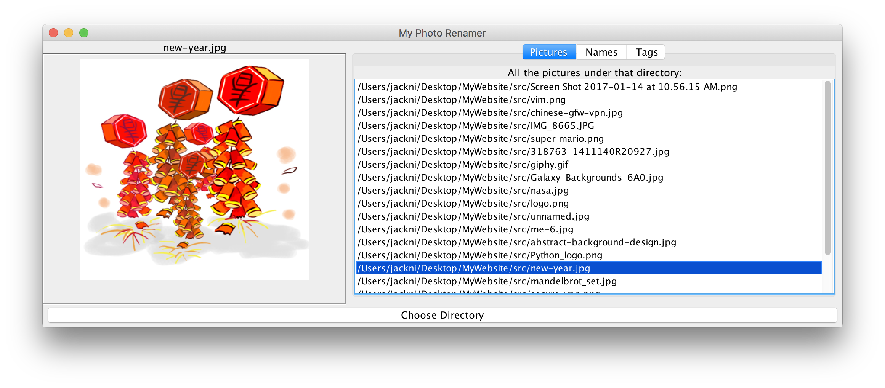
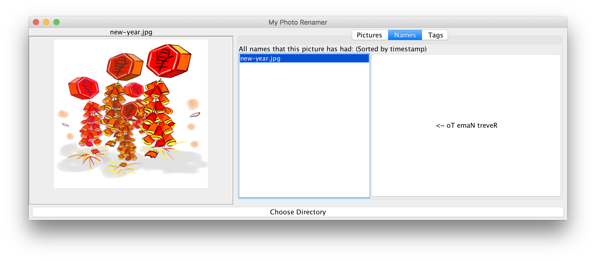
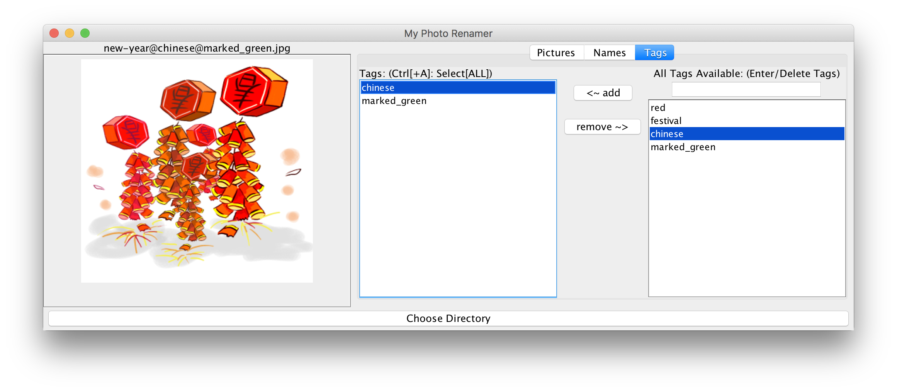
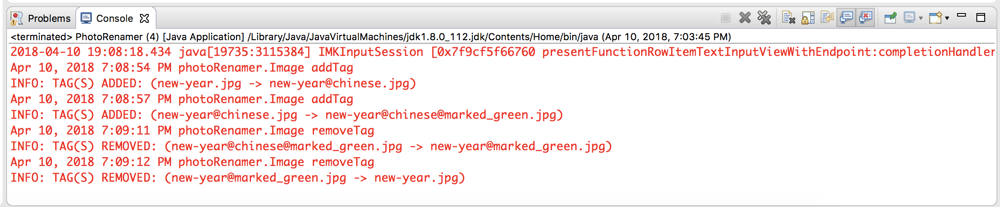
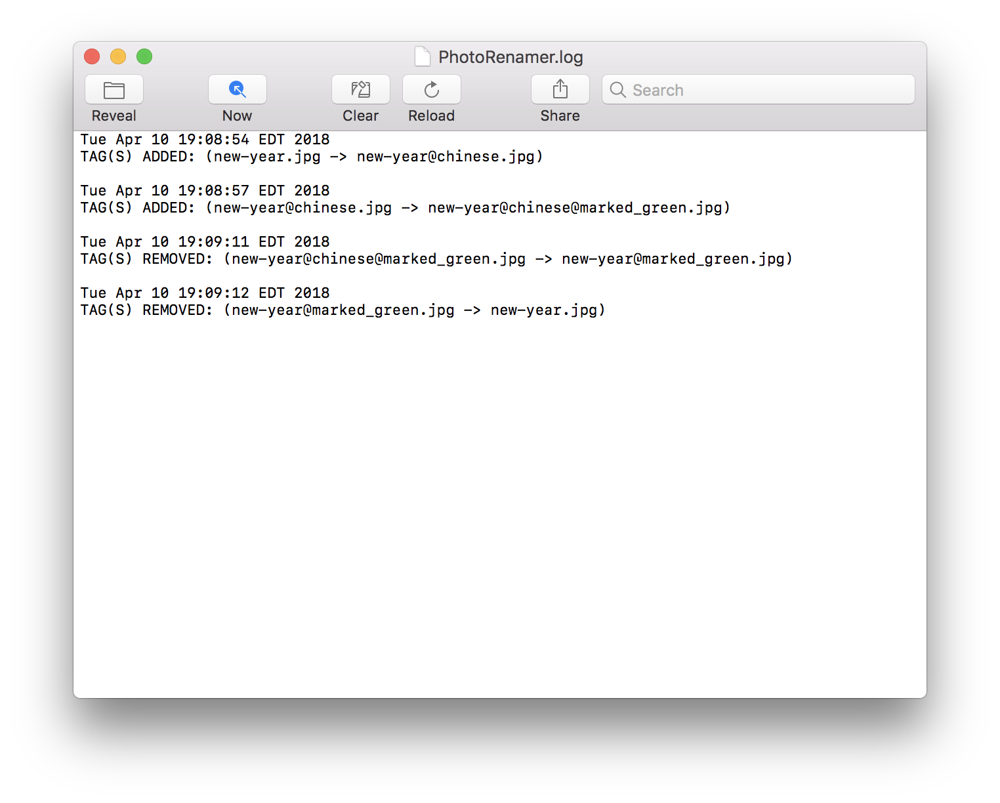
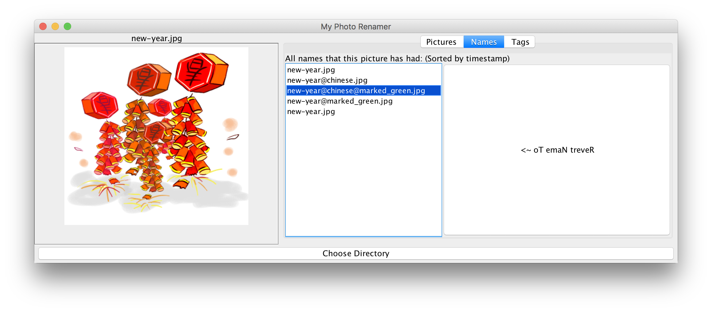
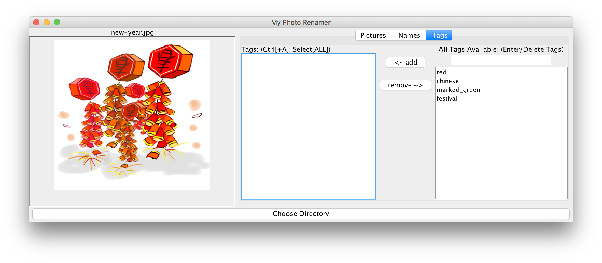

# PhotoRenamer
A Java application which manages all photos under a specified directory. 📷
  
  
  
When the user adds, deletes, or reverts a tag of the image, PhotoRenamer automatically writes a message to the local log file (PhotoRenamer.log).   
  
  
In addition, when the user closes this application, it writes all the history, including tags and images that PhotoRenamer is keeping track of, to a serialized binary file. Next time when the application is launched, it will first read in previous binary file (if exists), and restore all the history information.  
  
  

## Getting Started

### Prerequisites

* JDK 8
* Eclipse

### Download source code
```
# Change to HOME directory
$ cd ~

# Clone this repo
$ git clone https://github.com/jellycsc/PhotoRenamer.git
```

### Open this project in Eclipse
The following instructions are based on Eclipse 4.6.1 on macOS.
```
File -> Open Projects from File System... -> Directory... -> [HOME/PhotoRenamer] -> Finish
```
```
Run PhotoRenamer.java under photoRenamer package
```

## Authors

| Name             | GitHub                                     | Email
| ---------------- | ------------------------------------------ | -------------------------
| Chenjie Ni       | [jellycsc](https://github.com/jellycsc)    | nichenjie2013@gmail.com

## Thoughts and future improvements

* Develop a similar application on (or migrate it to) Android using Android Studio which can also be written in Java.

## Contributing to this project

1. Fork it [](https://github.com/jellycsc/PhotoRenamer/fork)
2. Create your feature branch (`git checkout -b my-new-feature`)
3. Commit your changes (`git commit -m 'Add some feature'`)
4. Push to your feature branch (`git push origin my-new-feature`)
5. Create a new Pull Request

Details are described [here](https://git-scm.com/book/en/v2/GitHub-Contributing-to-a-Project).

## Bug Reporting [](https://github.com/jellycsc/PhotoRenamer/issues/)

Please click `issue` button above↑ to report any issues related to this project  
OR you can shoot an email to <nichenjie2013@gmail.com>
